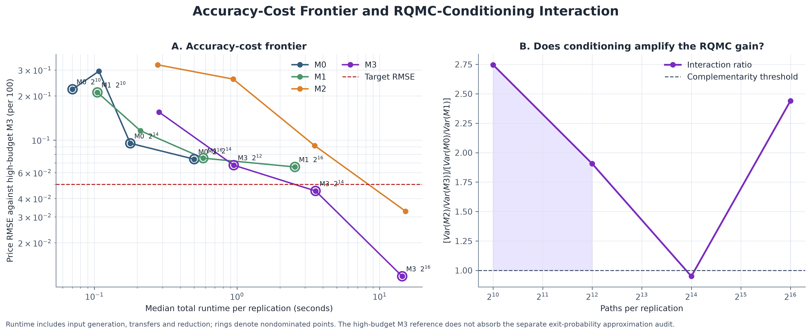

# RQMC & Brownian-Bridge Conditioning for Autocallables

**Pricing, fair coupons and Greeks of a three-asset worst-of autocallable.**

A research implementation comparing Monte Carlo, scrambled Sobol sampling and
Brownian-bridge conditioning under correlated geometric Brownian motion.
Developed for the MSc Risk Management and Financial Engineering Applied Project
at Imperial College Business School, by **Evelyn Wang**.

[Project report](report/project-report.pdf) · [中文说明](docs/README.zh-CN.md) ·
[Reproduction guide](docs/reproducibility.md) · [Research evidence](results/)

## Research question

Can better sampling and conditional expectations reduce the cost of accurate
autocallable prices and stable sensitivities? The study compares four estimators
while keeping the contract and model assumptions explicit:

| Method | Sampling | Knock-in treatment |
| --- | --- | --- |
| M0 | Standard Monte Carlo | Direct finite monitoring grid |
| M1 | Scrambled-Sobol RQMC | Direct finite monitoring grid |
| M2 | Standard Monte Carlo | Brownian-bridge conditional survival weights |
| M3 | Scrambled-Sobol RQMC | Brownian-bridge conditional survival weights |

The implementation separates continuous knock-in from discrete coupon and
autocall observations. It includes cash-flow decomposition, fair-coupon solving,
common-random-number finite-difference Greeks, a local discrete-trigger smoothing
diagnostic, and an optional float64 CUDA implementation.

## Main findings

These are **archived research results**, not outputs of the synthetic quickstart:

- The final high-budget M3 reference is **99.336888 per 100**, with replication
  SE **0.001541**; its fair coupon is approximately **9.685%**.
- M3 achieves price RMSE **0.011833** at 65,536 outer paths in the final study.
  M0 remains competitive at moderate accuracy requirements.
- Conditioning improves sensitivity precision near continuous knock-in, but
  does not resolve all discrete-autocall discontinuities. Only **12.5%** of the
  studied Gamma series pass the strict bump-shape plateau criterion.
- The original GPU study records **9.28×** warmed direct-pipeline speed-up at
  131,072 paths on an RTX 4060 Laptop GPU. Hardware, transfer and workload
  boundaries matter; the conditioned implementation retains CPU Bessel work.

See the [reference table](results/day9_main_experiments/reference_summary.csv),
[method comparison](results/day9_main_experiments/baseline_method_summary.csv),
and [full research status](docs/research-status-2026-08-11.md) for evidence and
stage-specific assumptions. Earlier validation stages use different settings;
their coupon estimates are not interchangeable with the final reference.



## Quickstart

Python 3.11 or later. From the repository root:

```bash
python -m venv .venv
# macOS / Linux:
source .venv/bin/activate
# Windows PowerShell instead:
# .venv\Scripts\Activate.ps1
python -m pip install -e ".[dev,notebooks]"
python examples/quickstart.py
python -m pytest -q
python scripts/verify_results.py
```

The example runs M0-M3 on **synthetic market inputs** using CPU only and writes
replication tables to `outputs/demo/`. It needs neither Bloomberg nor a GPU.
Small budgets demonstrate the interfaces and accounting checks; they are not
sufficient to establish estimator rankings or reproduce the report's numbers.

For a faster interface check:

```bash
python examples/quickstart.py --paths 256 --replications 2
```

## Repository map

| Path | Contents |
| --- | --- |
| `src/` | Direct and conditioned pricing, Greeks, optional GPU, experiment and analysis modules |
| `examples/` | Standalone synthetic CPU demonstration |
| `tests/` | 25 existing regression tests; GPU tests skip when CUDA is unavailable |
| `notebooks/` | Ten research notebooks, from contract validation through final experiments |
| `config/` | Frozen contracts, GPU validation and main-experiment budgets |
| `results/` | Saved replication CSVs, diagnostics and research figures |
| `report/` | Original research report with student ID removed |
| `docs/` | Reproduction guide, research history, provenance and Chinese introduction |
| `Data/` | Instructions for privately supplied market workbooks |

## Reproducibility and scope

This distribution does not include raw Bloomberg workbooks or third-party
papers. The synthetic example and tests run without those files. Re-executing
the market-calibrated notebooks requires an authorised copy of the frozen
workbook; see [Data/README.md](Data/README.md). Notebook outputs are cleared for
version control, with evidence retained separately in `results/` and the report.

The three-asset bridge uses exact marginal and pairwise probability terms with
a **finite nested estimate** of the trivariate term and feasibility projection.
The Lee-style logistic surrogate failed the out-of-sample gate and is retained
as a validation experiment, not used by M2/M3. The numerical reference uses M3
itself, so it cannot eliminate shared-estimator bias. Local autocall smoothing
is a component diagnostic, not a fifth full-product estimator.

RC-A is a stylised market-informed research contract, separate from the original
HSBC maturity-only note. Constant-volatility GBM, frozen correlations and the
omission of issuer credit, funding and liquidity constrain interpretation.

## Validation of this distribution

Local validation on 20 September 2026: **25 tests passed**, including the GPU
tests; the four-method synthetic example completed; the saved inventory of
**1,112 replications** and reference mean, SD and SE were checked. The complete
historical simulation grid and timing benchmark were not rerun for packaging.
GitHub Actions runs CPU checks on Python 3.11 and 3.13; CUDA checks require
compatible local hardware. See [validation details](docs/validation.md).

## Attribution

Research design, source selection, interpretation and report: Evelyn Wang.
AI-assisted implementation and verification are disclosed in the report's
original AI-use statement. The repository packaging adds portable paths, setup
instructions, CI, a synthetic example and privacy cleanup; it does not change
the six pricing/analysis modules. Original-file hashes are recorded in
[source provenance](docs/source-provenance.json).

The report contains the bibliography; key methodological sources are listed in
[references/README.md](references/README.md). No open-source licence is granted
by this repository at present. Reuse rights to the code, report and third-party
data must be agreed separately.
